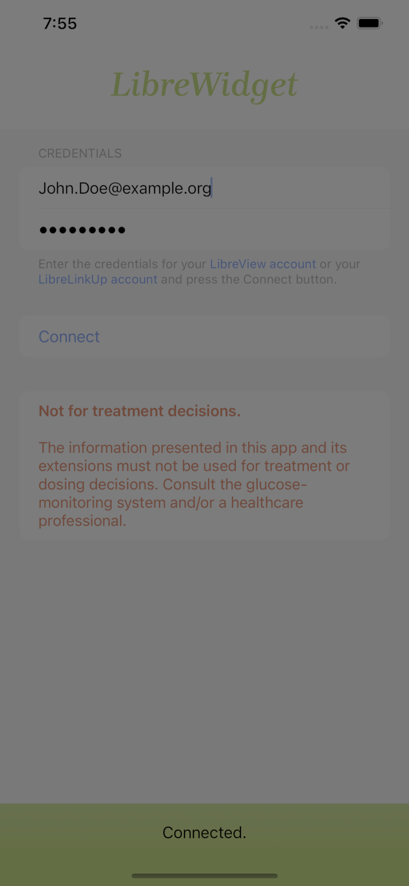
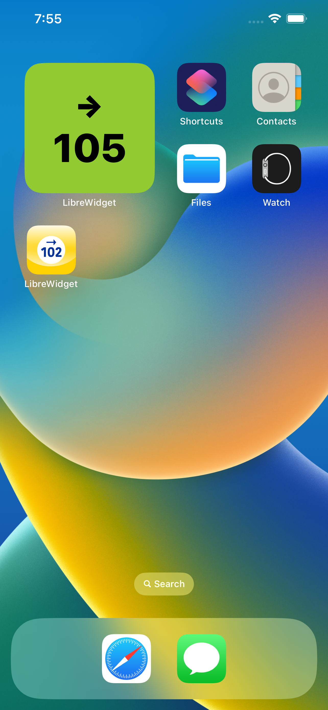
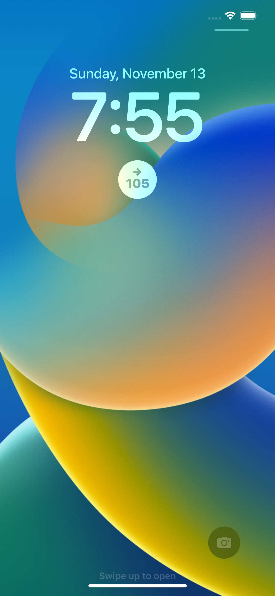

# LibreWidget

LibreWidget is an iOS application that extends the capabilities of the Libre Freestyle monitoring system with missing features.
Abbott did a good job with the Libre Freestyle 3, but unfortunately forgot some things on the UX side.
I had the expectation that my current glucose value would be displayed on the lock screen all of the time.
Unfortunately, this does not happen out-of-the-box.

This application makes all the difference.

Unfortunately, the application cannot be obtained from the AppStore because the API used is not public.
So you have to build your own local application.
If there is an increasing interest, a TestFlight link could be created.

## LibreWidget Setup View
  

## LibreGlucoseWidget: System Small
 

## LibreGlucoseWidget: Accessory Circular
  
